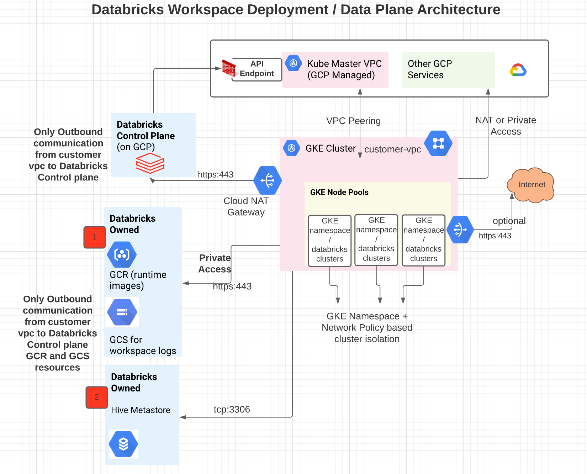

# Security Reference Architecture Template

# Introduction:

Databricks has worked with thousands of customers to securly deploy the Databricks platform with appropriate security features to meet their architecture requirements. 

This Security Reference Architecture (SRA) repository implements common security features as a unified terraform templates that are typically deployed by our security conscious customers.

Note that the private service connect blocks were previously developed in this [repository](https://github.com/bhavink/databricks/tree/master/gcpdb4u) and was helpful in putting the PSC-specific modules together.

# Component Breakdown and Description:

In this section, we break down each of the components that we've included in this Security Reference Architecture.

In various .tf scripts, we have included direct links to the Databricks Terraform documentation. The [official documentation](https://registry.terraform.io/providers/databricks/databricks/latest/docs) can be found here.

## Infrastructure Deployment:

- **Customer-managed VPC**: A [customer-managed VPC](https://docs.gcp.databricks.com/administration-guide/cloud-configurations/gcp/customer-managed-vpc.html) allows Databricks customer's to excersie more control over your network configures to comply with specific cloud security and governance standards that a customer's organization may require.

- **GCP VPC Endpoints for GCS**: Using GCP Private Service Connect
technology, a VPC endpoint is a service that connections a customer's VPC endpoint to GCP services while not traversing the public IP addresses.

- **Back-end GCP PrivateLink Connectivity**: GCP PrivateLink provides a private network route from one GCP environment to another. [Back-end Private Service Connect](https://docs.databricks.com/administration-guide/cloud-configurations/aws/privatelink.html#overview) is configured so that communication between the customer's data plane and Databricks control plane does not traverse public IP addresses. This is accomplished through Databricks specific interface VPC endpoints. Front-end Private Link is available as well for customers to have their users traffic remain over the GCP backbone, however, this is not represented in this Terraform template.


# Getting Started:

1. Clone this Repo 

2. Install [Terraform](https://developer.hashicorp.com/terraform/downloads)

3. Fill out `example.tfvars` and place in `gcp` directory

5. Change directoy into `gcp`

5. Run `terraform init`

6. Run `terraform validate`

7. From `gcp` directory, run `terraform plan -var-file ../example.tfvars`

8. Run `terraform apply -var-file ../example.tfvars`

Note: If you are running workspace module,please set DATABRICKS_GOOGLE_SERVICE_ACCOUNT environment variable with the Service Account email.Example :
```
export DATABRICKS_GOOGLE_SERVICE_ACCOUNT=<<Your GCP Service Account email>>
```
# Network Diagram


